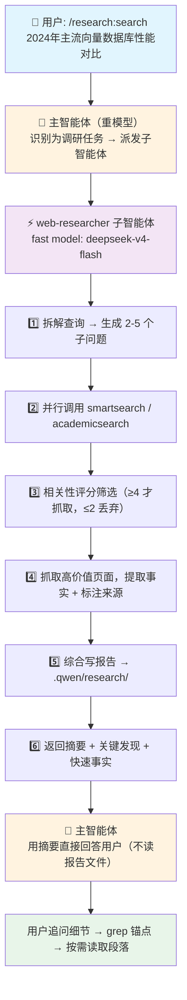

# web-researcher

[websearch-mcpserver](https://github.com/daidaiJ/websearch-mcpserver) 的配套 Qwen Code 扩展。

使用 Qwen Code 时，主模型的上下文窗口非常宝贵。当你让主智能体去做网络调研——搜索、抓取网页、筛选信息——大量原始内容会涌入上下文，挤占后续编码对话的空间。

**本扩展的解法**：将调研任务交给一个专用的 fast model 子智能体（默认 `deepseek-v4-flash`）去处理。子智能体独立完成搜索→筛选→抓取→综合的全流程，生成结构化报告存到本地，只把精炼的摘要返回给主智能体。主模型的上下文始终保持干净。

## 主要功能

### 🔍 网络调研卸载

通过 `/research:search <query>` 一键派发调研任务。子智能体自动：
- 将查询拆解为多个子问题并行搜索
- 按相关性 1-5 分筛选结果，丢弃低质量内容
- 抓取高价值页面，提取关键事实并标注来源
- 综合所有发现，生成结构化 Markdown 报告
- 将报告存入 `.qwen/research/`，返回精炼摘要

主智能体**直接使用返回的摘要回答你**，正常情况下不会读取报告文件，上下文零膨胀。

### 📊 报告管理与回溯

调研结果持久化存储，支持：
- `/research:reports` — 列出所有历史报告，查看 META 摘要
- `/research:read <keyword>` — 按关键词搜索报告，分层读取（先摘要，按需展开具体发现）

适合多次调研之间的交叉引用和回溯查阅。

### 📐 结构化报告设计

报告采用 `FINDING-*`、`DATA-*`、`CONFLICT-*` 锚点标记，每个内容块自包含。主智能体需要追问细节时，只需 grep 锚点定位 + 按行读取对应段落，无需加载整份报告。

## 工作流程



**为什么这样设计？**

| 痛点 | 解法 |
|------|------|
| 网络搜索返回大量原始内容，撑爆主模型上下文 | 子智能体在独立上下文中处理，只返回摘要 |
| 主模型做搜索任务成本高、速度慢 | 子智能体用 fast model，便宜快速 |
| 调研结果用完即丢，无法回溯 | 报告持久化到 `.qwen/research/`，支持后续查阅 |
| 主智能体需要细节时要重新搜索 | 按需 grep 锚点 + 分段读取，零冗余加载 |

## 前置依赖

需要先部署 [websearch-mcpserver](https://github.com/daidaiJ/websearch-mcpserver)，它提供 `smartsearch`（通用搜索）和 `academicsearch`（学术检索）两个 MCP 工具。

### 1. 下载

从 [Releases](https://github.com/daidaiJ/websearch-mcpserver/releases) 页面下载 Windows 版本：

```
websearch-mcpserver-windows-amd64.exe
```

### 2. 安装为自启动服务

在 exe 所在目录执行：

```bash
./websearch-mcpserver-windows-amd64.exe install
```

这会生成 `config.yaml` 配置文件和 `autostart.vbs` 启动脚本。

### 3. 修改配置

编辑生成的 `config.yaml`，按需配置搜索引擎 API Key 等参数。

### 4. 首次启动

双击 `autostart.vbs` 完成首次启动。之后每次开机将自动启动服务。

### 5. 注册到 Qwen Code

服务启动后（默认监听 `localhost:8338`），执行：

```bash
qwen mcp add --transport http websearch http://localhost:8338/mcp
```

## 安装扩展

将本仓库 clone 或下载到本地，然后在 Qwen Code 中注册：

```bash
qwen extension add /path/to/web-researcher
```

## 使用方式

扩展注册后提供以下命令：

| 命令 | 说明 |
|------|------|
| `/research:search <query>` | 派发调研任务给子智能体 |
| `/research:reports [keyword]` | 列出已有报告（仅 META 摘要） |
| `/research:read <keyword>` | 按关键词搜索并分层读取报告 |

### 示例

```
/research:search 2024 年主流向量数据库性能对比
```

子智能体会自动执行搜索、筛选、提取、综合，生成结构化报告存入 `.qwen/research/`，并返回摘要。主智能体直接用摘要回答你，**不占用主模型的上下文**。

需要追问细节时，主智能体会按需 grep 报告中的 `FINDING-`、`DATA-` 等锚点，分段读取。

## 项目结构

```
web-researcher/
├── qwen-extension.json          # 扩展元数据
├── QWEN.md                      # 主智能体上下文注入
├── agents/
│   └── web-researcher.md        # 子智能体定义（prompt + 模型 + 工具）
├── commands/research/
│   ├── search.md                # /research:search 命令
│   ├── reports.md               # /research:reports 命令
│   └── read.md                  # /research:read 命令
└── skills/consuming-research-reports/
    └── SKILL.md                 # 报告消费指南（教主智能体如何读报告）
```

## 报告格式

报告存储在 `.qwen/research/` 目录下，结构如下：

```
.qwen/research/
├── k8s-gpu-scheduling_20260529.md
├── sources/
│   └── k8s-gpu_1.md            ← 原文引用（markdown 链接）
└── llm-finetuning-methods_20260529.md
```

每份报告结构：`META` → `SUMMARY` → `FINDINGS` → `DATA` → `CONFLICTS` → `SOURCES`

## License

MIT
